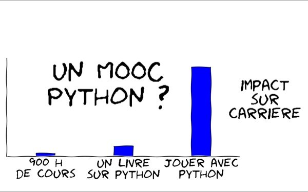

# Course material from MOOC « Python : des fondamentaux à l’utilisation du langage »
Authors: Thierry Parmentelat & Arnaud Legout

Licence CC BY-NC-ND

Inria 41001S02, Ended - Nov 01, 2015

* https://learninglab.inria.fr/mooc-python-fondamentaux-utilisation-langage/
* https://www.fun-mooc.fr/courses/inria/41001S02/session02/info
* https://www.fun-mooc.fr/courses/inria/41001S03/session03/about
