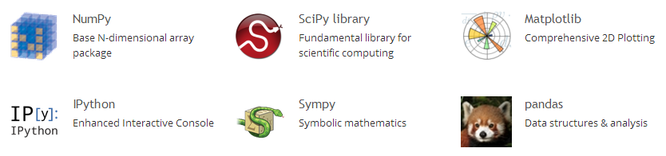

# Python packages

## NumPy

http://www.numpy.org/

Many features of Matlab in a free multiplatform program
The _Numeric_ package addresses these issues, providing high-performance support for multidimensional arrays (matrices) and advanced mathematical operations, such as linear algebra and Fourier transforms. Numeric does not come with standard Python distributions, but you can freely download it at http://sourceforge.net/projects/numpy, either as source code (which is easy to build and install on many platforms) or as a prebuilt self-installing .exe file for Windows. Visit http://www.pfdubois.com/numpy/ for an extensive tutorial and other resources, such as a mailing list about Numeric. Note that the _Numeric_ package is not just for numeric processing. Much of _Numeric_ is about multidimensional arrays and advanced array handling that you can use for any Python sequence.

NumPy is the fundamental package for scientific computing with Python. It contains among other things:
-	a powerful N-dimensional array object
-	sophisticated (broadcasting) functions
-	tools for integrating C/C++ and Fortran code
-	useful linear algebra, Fourier transform, and random number capabilities

Besides its obvious scientific uses, NumPy can also be used as an efficient multi-dimensional container of generic data. Arbitrary data-types can be defined. This allows NumPy to seamlessly and speedily integrate with a wide variety of databases.

## SciPy

http://www.scipy.org/

Scientific Computing Tools for Python

SciPy refers to several related but distinct entities:
*	The SciPy Stack, a collection of open source software for scientific computing in Python, and particularly [a specified set of core packages](http://www.scipy.org/stackspec.html).
*	The community of people who use and develop this stack.
*	Several conferences dedicated to scientific computing in Python - SciPy, EuroSciPy and SciPy.in.
*	The [SciPy library](http://www.scipy.org/scipylib/index.html), one component of the SciPy stack, providing many numerical routines.

The SciPy stack

*	Python, a general purpose programming language. It is interpreted and dynamically typed and is very suited for interactive work and quick prototyping, while being powerful enough to write large applications in.
*	[NumPy](http://numpy.scipy.org/), the fundamental package for numerical computation. It defines the numerical array and matrix types and basic operations on them.
*	The [SciPy library](http://www.scipy.org/scipylib/index.html), a collection of numerical algorithms and domain-specific toolboxes, including signal processing, optimization, statistics and much more.
*	[Matplotlib](http://matplotlib.org/), a mature and popular plotting package, that provides publication-quality 2D plotting as well as rudimentary 3D plotting
*	[pandas](http://pandas.pydata.org/), providing high-performance, easy to use data structures.
*	[SymPy](http://sympy.org/), for symbolic mathematics and computer algebra.
*	[IPython](http://ipython.org/), a rich interactive interface, letting you quickly process data and test ideas. The IPython notebook works in your web browser, allowing you to document your computation in an easily reproducible form.
*	[nose](https://nose.readthedocs.org/en/latest/), a framework for testing Python code.

## NLTK Module
www.nltk.org : Natural Language Toolkit

## PyDataLog
https://sites.google.com/site/pydatalog/home

## PyDev for eclipse
