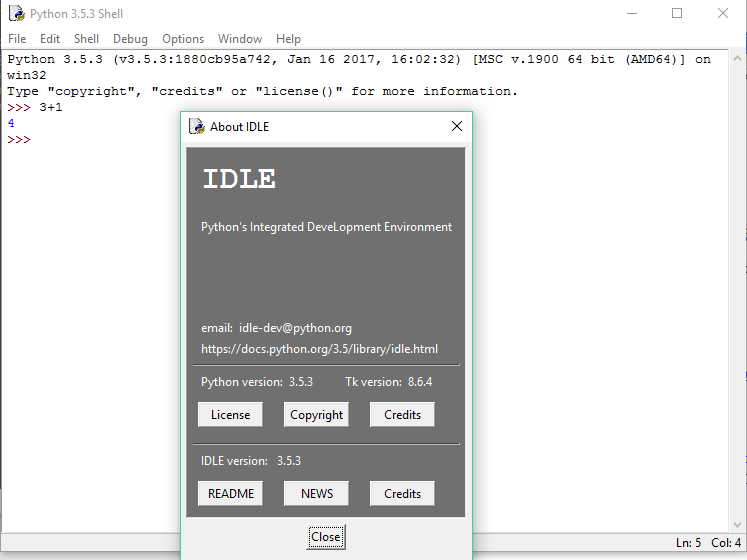

# Python Setup

## Env
The minimum is to add to the **PATH** the location of the python.exe program. (%PYTHONHOME%)
Depending on the chosen Python distribution, additional setup can be useful.


### WinPython
[WinPython](https://winpython.github.io/)

With a WinPython distribution, adding the install location and the script to the PATH will be a goood way to set minimum env variables.
Indeed, when invoking python from the cmd line, windows lookup will find first python.bat which itself call env.bat and set additional env variables for python.

* <WinPython Dir>: WinPython Command Prompt.exe, Jupyter Notebook.exe, ...
* <WinPython Dir>\scripts: python.bat, env.bat, cmd.bat, winspyder.bat
```
PATH: C:\Python34\;C:\Python34\scripts;
```

```
<WinPython Dir>
├── notebooks
├── scripts
    └── env.bat
    └── cmd.bat
	  └── python.bat
	  └── spyder.bat
└── settings
    └── winpython.ini
└── tools
    └── 7z.exe, pandox.exe
└── python-3.4.3                    < %WINPYDIR% or %PYTHONHOME% >
    └── python.exe, pythonw.exe
    └── Lib                         < %PYTHONPATH% >
    └── Scripts
	     └── pip.exe, easyinstall.exe, ...
├── Spyder.exe, Qt Designer.exe
├── "WinPython Interpreter.exe", "WinPython Command Prompt.exe"
```

Launching Python intpreter from "WinPython Interpreter.exe" launch the env (%WINPYDIR%/scripts/env.bat, python.bat).

This sets WINPYDIR, WINPYVER, WINPYARCH, ... variables and adds entries to the PATH :
- WINPYDIR: T:\PortableApps\Python\WinPython-32bit-3.4.3.5\python-3.4.3
  <=> PYTHONHOME
- WINPYVER: 3.4.3.5

```
set PATH=
%WINPYDIR%\Lib\site-packages\PyQt5;
%WINPYDIR%\Lib\site-packages\PyQt4;
%WINPYDIR%\;
%WINPYDIR%\DLLs;
%WINPYDIR%\Scripts;
%WINPYDIR%\..\tools;
%WINPYDIR%\..\tools\mingw32\bin;
%WINPYDIR%\..\tools\R\bin\i386;
%WINPYDIR%\..\tools\Julia\bin;
%PATH%;
```

Running directly the python.exe under %PYTHONHOME% will not set anything

### Python launcher
python34.bat
```
:: wrapper for Python 3.4 : set Python 3.4 environment and run Python (Cmd prompt)
@echo off
call %~dp0set_py34.bat
%PYTHONHOME%\python.exe %*
```

```
@echo off
set _DRIVE=%~d0
:: WinPython Directory (different than WINPYDIR which is equivalent to PYTHONPATH)
set WINPYTHONDIR=%_DRIVE%\PortableApps\Python\WinPython-32bit-3.4.3.5
::set HOME=%WINPYTHONDIR%\settings
SET PYTHONHOME=%WINPYTHONDIR%\python-3.4.3
SET PYTHONPATH=%WINPYTHONDIR%\python-3.4.3\Lib
SET WINPYVER=3.4.3
SET PYTHONSTARTUP=%_DRIVE%\PortableApps\Scripts\Python\startup_py3.py
:: add to PATH :
SET PATH=%PYTHONHOME%;%PYTHONHOME%\Scripts;%PYTHONPATH%\site-packages\PyQt4;%PATH%
SET PATH=%_DRIVE%\PortableApps\Python\Scripts;%PATH%
```
https://github.com/winpython/winpython/issues/351

### Python Environment
https://www.tutorialspoint.com/python/python_environment.htm

PYTHONHOME: Alternate prefix directory (or prefix:exec_prefix). The default module search path uses prefix/lib


```python
import os
os.getenv('WINPYVER')
os.getenv('WINPYDIR')

import sys
if "C:\\My_Python_Lib" not in sys.path:
    sys.path.append("C:\\My_Python_Lib")
```

### Windows File association
add .py |.pyw to %PATHEXT%
* http://stackoverflow.com/questions/9037346/making-python-scripts-run-on-windows-without-specifying-py-extension

```
assoc .py=Python.File
ftype Python.File=c:\Python27\python.exe "%1" %*

ftype Python.File="C:\Windows\py.exe" "%1" %*
```

cf utility in windows to set file association
* http://defaultprogramseditor.com/


## Python Startup
### PyScripter
PySCripter  %PyScripterDir%/python_init.py
```
from python
from __future__ import print_function
```

### PythonStartup variable
set PYTHONSTARTUP PYTHONSTARTUP=/path/to/init.py (works for interactive sessions)

If this is the name of a readable file, the Python commands in that file are executed before the first prompt is displayed in interactive mode (no default).

### site.py
- T:\PortableApps\Python\Python2.7.6.1\App\Lib\site-packages\site.py
   - sitecustomize.py
   - usercustomize.py
- T:\PortableApps\Python\WinPython-32bit-2.7.10.2\python-2.7.10\Lib\site.py
- %WINPYDIR%\WinPython-32bit-3.4.3.5\settings\.ipython\profile_default\startup

```
This is the IPython startup directory

.py and .ipy files in this directory will be run *prior* to any code or files specified
via the exec_lines or exec_files configurables whenever you load this profile.

Files will be run in lexicographical order, so you can control the execution order of files
with a prefix, e.g.::

    00-first.py
    50-middle.py
    99-last.ipy
```

* https://docs.python.org/3.3/tutorial/interpreter.html#the-interactive-startup-file
* https://docs.python.org/3/library/site.html
* http://stackoverflow.com/questions/11404165/python-startup-script


# Python IDE

Komodo, NetBeans, Python Tools for Visual Studio – an add-on for Microsoft Visual Studio, PyStudio, PyDev – an open-source plug-in for Eclipse

## Spyder

## PyScripter
PyScriper can run with Unregistered/Portable Python.

PyScripter 2.6 is working with Python up to 3.4

- https://sourceforge.net/projects/pyscripter/
- https://sourceforge.net/p/pyscripter/wiki/FAQ/
   - How do I use PyScripter with Portable (Movable) Python?
- https://github.com/pyscripter/pyscripter/wiki/Features

PyScripter launcher
```
SET PYTHONHOME=E:\PortablePython25
PyScripter --PYTHON25 --PYTHONDLLPATH "E:\PortablePython" %1 %2 %3 %4 %5
```

PyScripter launcher
```
@echo off
call %~dp0set_py34.bat
%DRIVE%\PortableApps\Python\PyScripter\PyScripter.exe --PYTHON34 --PYTHONDLLPATH %PYTHONHOME%
```

<%PyScripterDir%>\PyScripter.bat to be used as a ShortCut (cmd terminal opened and closed)
```
@echo off
set PYTHONHOME=C:\Tools\Python\WinPython-64bit-3.5.2.3\python-3.5.2.amd64
start PyScripter.exe --PYTHON35 --PYTHONDLLPATH "%PYTHONHOME%" %*
```

```
:: PyScripter launcher to set WinPython from current directory and start PyScripter IDE
:: location %WinPythonDir%\PyScripter.bat
@echo off
::@echo on
:: call the env.bat avaialble with WinPython (%WinPythonDir%\scripts). This sets the %WINPYDIR% env variable. %PYTHONHOME%=%WINPYDIR% is required for PySCripter
call "%~dp0/scripts/env.bat"
set PYTHONHOME=%WINPYDIR%
set PyScripterDir=T:\PortableApps\Python\PyScripter
::start PyScripter.exe --PYTHON35 --PYTHONDLLPATH %PYTHONHOME%
start /b %PyScripterDir%\PyScripter.exe --PYTHON34 --PYTHONDLLPATH "%PYTHONHOME%" %*
:: >>>
:: import os
:: os.getenv('PYTHONPATH')
```

The %PYTHONHOME% environment variable is required but not used by PyScripter directly but by Python to find the installed libraries.


### PyScripter.ini
lookup under
1) Exe directory
2) %APPDATA% (environment varaible)
3) %APPDATA%\Pyscripter

## Python IDLE (Integrated DevLopment  Env)

Pour ouvrir IDLE, distribué dans la distribution standart de Python, il suffit d'exécuter le fichier <PYTHONHOME>/lib/idlelib/idle.pyw
See also /python2.7.6.1/App/Lib/dlelib/dle.bat
```
set CURRDIR=%~dp0
start "IDLE" "%CURRDIR%..\..\pythonw.exe" "%CURRDIR%idle.pyw" %1 %2 %3 %4 %5 %6 %7 %8 %9
```

IDLE can be launched from the python prompt
```{python}
>>> import idlelib.PyShell
>>>idlelib.PyShell.main()
```
* http://stackoverflow.com/questions/118260/how-to-start-idle-python-editor-without-using-the-shortcut-on-windows-vista
*	http://stackoverflow.com/questions/2345607/starting-python-idle-from-command-line-to-edit-scripts
*	http://askubuntu.com/questions/337395/open-python-file-with-idle-using-terminal-on-ubuntu-12-04


# Python Package Mgmt
https://packaging.python.org/tutorials/installing-packages/
https://github.com/winpython/winpython/wiki/Installing-Additional-Packages

## pip
a command-line package management system
The executable is located under <%PYTHONHOME%>/Scripts : pip.exe
* https://pip.pypa.io/
* download : https://pypi.python.org/pypi/pip#downloads
* https://pip.pypa.io/en/latest/installing.html
* http://stackoverflow.com/questions/4750806/how-to-install-pip-on-windows

```
pip list
pip install [package-name]

pip uninstall [package-name]
```
o	intall pip using : $ python get-pip.py

### pip on windows
* http://stackoverflow.com/questions/4750806/how-to-install-pip-on-windows
Python 3.4 (released March 2014) and Python 2.7.9 (released December 2014) ship with Pip
* https://reformatcode.com/code/python/how-to-install-pip-on-windows

### pip-win
tiny Python Package manager that is super easy to install. It automatically installs pip and virtualenv on Windows /pydatalog/python/pip-for-windows
https://sites.google.com/site/pydatalog/python/pip-for-windows

### using pip to list installed packages
```
import pip
installed_packages = pip.get_installed_distributions()
installed_packages_list = sorted(["%s==%s" % (i.key, i.version)
     for i in installed_packages])
print(installed_packages_list)

sorted(["%s==%s" % (i.key, i.version) for i in pip.get_installed_distributions()])
```
```
['lxml==2.3', 'matplotlib==1.2.1', 'numpy==1.7.1', 'pandas==0.11.0', 'py2exe==0.6.9', 'pycairo==1.8.10', 'pygame==1.9.1', 'pygobject==2.28.3', 'pygoocanvas==0.14.2', 'pygtk==2.24.0', 'pygtksourceview==2.10.1', 'pyodbc==3.0.6', 'pyrsvg==2.32.1', 'pywin32==218', 'scipy==0.12.0']
```

- http://stackoverflow.com/questions/12939975/how-to-list-all-installed-packages-and-their-versions-in-python
- http://stackoverflow.com/questions/739993/how-can-i-get-a-list-of-locally-installed-python-modules

## Setup Tools and Package Manager
**Setuptools** : Easily download, build, install, upgrade, and uninstall Python packages.
Note : distribute is a fork of setuptools (now merged back). setuptools is an enhancement of distutils
- https://pypi.python.org/pypi/setuptools
- [setuptools @wikipedia](http://en.wikipedia.org/wiki/Setuptools)
- [setuptools doc](https://pythonhosted.org/setuptools/index.html)

EasyInstall : Easy Install is a python module (easy_install) bundled with setuptools that lets you automatically download, build, install, and manage Python packages.

```
# install
pip install -U setuptools
pip install git+https://bitbucket.org/pypy/numpy.git
```  

## virtualenv
https://virtualenv.pypa.io/en/latest/
